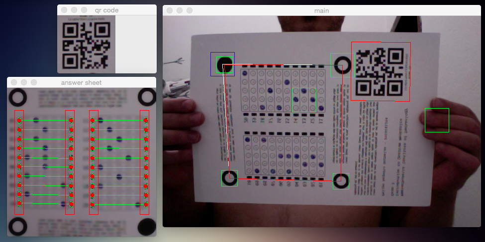

Cyclops
=======

Answer sheet optical recognition proof of concept using Python and OpenCV. I've written some custom Computer Vision and Linear Algebra algorithms.

Still a prototype under heavy development. Please don't mind the mess.



# Requirements

- Python 3.6+
- [Pipenv](https://pypi.python.org/pypi/pipenv)
- [OpenCV](http://opencv.org) 3.4+ with Python bindings
- [zbar](http://zbar.sourceforge.net)

# Setup

These instructions cover macOS only, although it might be possible to setup the application in any Unix compatible environment.

For macOS, we recommend using the [Homebrew](http://brew.sh) package manager.

## Installing OpenCV with Python bindings

```sh
$ brew install opencv3
```

Follow the "Caveat" instructions from Homebrew in order to link OpenCV with Python.

To check if everything is working, open the Python console and try to import the `cv2` package. If you didn't get any errors it means everything is probably OK.

## Installing ZBar

Zbar can be installed using Homebrew:

```sh
$ brew install zbar
```

This will install the `zbarimg` command.

## Creating the virtual environment

If you don't have pipenv installed, you can get it from Homebrew:

```sh
$ brew install pipenv
```

Create a new Python 3 virtual environment with bindings to system packages:

```sh
$ pipenv --three --site-packages
```

Install runtime and development dependencies:

```sh
$ pipenv install
$ pipenv install -d
```

# Running the Application

Run the `cyclops.sh` script passing as argument one of the images from the `Samples` folder.

There's a real-time interactive camera mode that can be activated using `cyclops-camera.sh`. You can print an answer sheet and show it to the camera on your computer. Works best if the paper is displayed horizontally.

# Running Automated Tests

Run the `unit-test.sh` script to run the suite of automated unit tests.

You can run a quick sanity integration test to check the health of the algorithms through the script `sanity-test.sh`.
